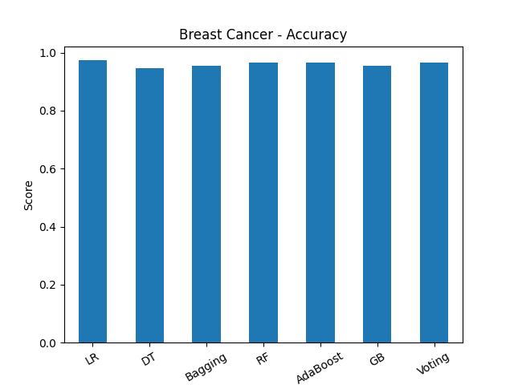
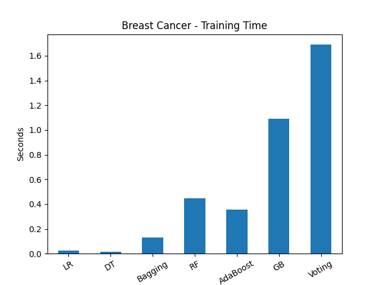
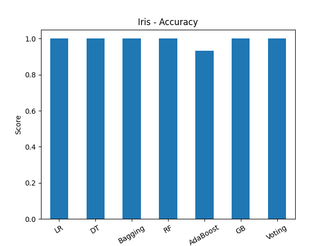
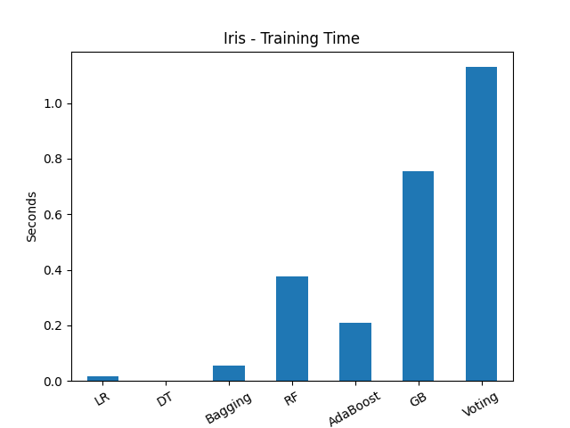
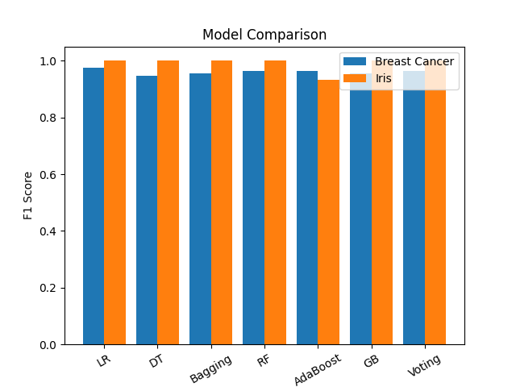

# Lab 12 — Ensemble Learning Model Comparison

## Aim

To implement and compare multiple ensemble learning classifiers — **Bagging**, **Random Forest**, **AdaBoost**, **Gradient Boosting**, and **Voting Classifier** — alongside baseline models (Logistic Regression and Decision Tree) across two real-world datasets (Breast Cancer and Iris), and evaluate them on Accuracy, F1 Score, and Training Time.

---

## Theory

Ensemble learning combines multiple individual models (called **base learners**) to produce a stronger, more generalizable model. The core idea is that a group of weak learners can come together to form a strong learner. There are three main ensemble strategies: **Bagging**, **Boosting**, and **Stacking/Voting**.

### Baseline Models

#### Logistic Regression (LR)
A linear probabilistic classifier that models the log-odds of the target class. Serves as a simple, interpretable baseline. It assumes a linear decision boundary and works well when features are linearly separable.

#### Decision Tree (DT)
A non-linear model that splits the feature space using a series of threshold-based rules (Gini impurity or entropy). Decision Trees are prone to overfitting but are fast to train and highly interpretable.

---

### Ensemble Methods

#### 1. Bagging (Bootstrap Aggregating)
Bagging trains multiple versions of the same base estimator on different **bootstrap samples** (random subsets with replacement) of the training data and aggregates predictions by majority vote (classification) or averaging (regression).

- **Goal:** Reduce **variance** without increasing bias.
- **Base estimator:** Decision Tree (by default in sklearn's `BaggingClassifier`).
- **Key idea:** Each model sees a slightly different version of the data, so their errors are less correlated.

#### 2. Random Forest (RF)
Random Forest is an extension of Bagging that adds an additional layer of randomness — at each split, only a **random subset of features** is considered rather than all features. This further decorrelates the trees.

- **Goal:** Reduce variance through decorrelated trees.
- **Advantage:** More robust to overfitting than a single Decision Tree; handles high-dimensional data well.
- **Key parameter:** `n_estimators` — number of trees (default: 100).

#### 3. AdaBoost (Adaptive Boosting)
AdaBoost is a **sequential boosting** algorithm. It trains a series of weak learners (typically shallow trees, called stumps), where each subsequent learner **focuses more on the misclassified samples** from the previous one. Final prediction is a weighted vote of all learners.

- **Goal:** Reduce **bias** by iteratively correcting errors.
- **Key parameter:** `n_estimators` — number of boosting rounds.
- **Weakness:** Sensitive to noisy data and outliers since it assigns higher weights to misclassified samples.

#### 4. Gradient Boosting (GB)
Gradient Boosting is also a sequential boosting method, but instead of re-weighting samples, it fits each new learner to the **residual errors** (gradients of the loss function) of the previous ensemble. This is a more general framework than AdaBoost.

- **Goal:** Reduce bias through gradient descent in function space.
- **Advantage:** Often achieves the highest accuracy among ensemble methods.
- **Weakness:** Slower to train; more hyperparameters to tune (`learning_rate`, `max_depth`, `n_estimators`).

#### 5. Voting Classifier
Voting Classifier combines multiple heterogeneous models (different algorithms) and aggregates their predictions. In **soft voting**, the predicted class probabilities are averaged across all models, and the class with the highest average probability wins.

- **Composition in this experiment:** Logistic Regression + Random Forest + Gradient Boosting.
- **Voting type:** Soft voting (uses predicted probabilities).
- **Goal:** Exploit the complementary strengths of different model types.
- **Trade-off:** Highest training time since all sub-models must be trained.

---

## Datasets

| Dataset        | Samples | Features | Classes | Task                                       |
|---------------|---------|----------|---------|--------------------------------------------|
| Breast Cancer  | 569     | 30       | 2       | Binary classification (Malignant / Benign) |
| Iris           | 150     | 4        | 3       | Multi-class classification (3 flower species) |

All features were standardized using `StandardScaler`. An 80/20 train-test split was used with `random_state=42`.

---

## What Was Built

A Python notebook (`Ensemble_Learning_Comparison.ipynb`) that:

1. Loads and preprocesses both the Breast Cancer and Iris datasets
2. Defines all 7 models in a unified dictionary for clean iteration
3. Trains each model, records training time, and evaluates on the test set
4. Computes Accuracy and weighted F1 Score for each model
5. Produces per-dataset bar charts (Accuracy, F1, Time) and a cross-dataset F1 comparison plot

---

## Results & Visualizations

### Breast Cancer Dataset

#### Accuracy



All models achieve **~95–97% accuracy** on Breast Cancer. Logistic Regression (LR) slightly edges out the rest — the dataset is linearly separable in standardized space. Decision Tree (DT) scores the lowest (~94%) due to overfitting tendencies.

#### F1 Score


F1 trends mirror accuracy closely. LR achieves ~0.97, while DT sits at ~0.94. All ensemble methods (Bagging, RF, AdaBoost, GB, Voting) cluster around 0.95–0.96, showing robust and consistent performance.

#### Training Time



| Model    | Approx. Time (s) |
|---------|-----------------|
| LR       | ~0.03           |
| DT       | ~0.01           |
| Bagging  | ~0.13           |
| RF       | ~0.45           |
| AdaBoost | ~0.35           |
| GB       | ~1.10           |
| Voting   | ~1.67           |

LR and DT are the fastest. Voting Classifier takes the longest since it trains three full models internally. GB is the second-heaviest due to its sequential tree-building process.

---

### Iris Dataset

#### Accuracy



Most models achieve **100% accuracy** on Iris, except AdaBoost which scores ~93%. Iris is a small, clean, and relatively easy dataset — most algorithms can fit it nearly perfectly.

#### F1 Score


F1 scores mirror accuracy. LR, DT, Bagging, RF, GB, and Voting all reach **1.00**. AdaBoost again lags at ~0.93, likely because its shallow stumps struggle with the 3-class boundary on this dataset with default settings.

#### Training Time



| Model    | Approx. Time (s) |
|---------|-----------------|
| LR       | ~0.01           |
| DT       | ~0.00           |
| Bagging  | ~0.06           |
| RF       | ~0.38           |
| AdaBoost | ~0.21           |
| GB       | ~0.75           |
| Voting   | ~1.12           |

Times are lower than Breast Cancer due to Iris having fewer samples (150 vs 569) and fewer features (4 vs 30). The relative ordering of models remains the same.

---

### Cross-Dataset F1 Comparison



This grouped bar chart directly compares each model's weighted F1 Score across both datasets. Key observations:

- **Iris (orange) consistently scores higher or equal** to Breast Cancer (blue) — the dataset is simpler and smaller.
- **AdaBoost** is the only model where Iris scores notably lower (~0.93) compared to Breast Cancer (~0.96), making it the least consistent model.
- **Random Forest and Gradient Boosting** deliver strong, consistent performance on both datasets.
- **Voting Classifier** performs reliably across both, validating the benefit of combining complementary models.

---

## Key Takeaways

- **Best accuracy/F1:** Logistic Regression on Breast Cancer (~0.97); most models tie at 1.00 on Iris.
- **Most consistent ensemble:** Random Forest and Gradient Boosting deliver top performance on both datasets with reasonable training times.
- **Fastest model:** Decision Tree and Logistic Regression — excellent baselines when speed matters.
- **Slowest model:** Voting Classifier — trains multiple models internally, so cost adds up.
- **AdaBoost weakness:** Sensitive to multi-class settings with default parameters; performed worst on Iris.
- **Bagging vs RF:** Random Forest consistently matches or beats plain Bagging by introducing feature-level randomness in addition to data-level randomness.
- Ensemble methods generally outperform single Decision Trees, confirming that **combining weak learners reduces overfitting**.

---

## How to Run

```bash
# Install dependencies
pip install scikit-learn numpy pandas matplotlib

# Open and run the notebook
jupyter notebook Ensemble_Learning_Comparison.ipynb
```

No external data download needed — both Breast Cancer and Iris are loaded directly from `sklearn.datasets`.

---

## Files

```
Lab12-Ensemble-Learning/
├── Ensemble_Learning_Comparison.ipynb   # Main experiment notebook
├── Breast_Cancer_accuracy.png           # Breast Cancer accuracy bar chart
├── Breast_Cancer_f1.png                 # Breast Cancer F1 score bar chart
├── Breast_Cancer_time.png               # Breast Cancer training time chart
├── Iris_accuracy.png                    # Iris accuracy bar chart
├── Iris_f1.png                          # Iris F1 score bar chart
├── Iris_time.png                        # Iris training time chart
├── comparison.png                       # Cross-dataset F1 comparison
└── README.md                            # This file
```

---

*Lab 12 | Data Mining | Ensemble Learning*
