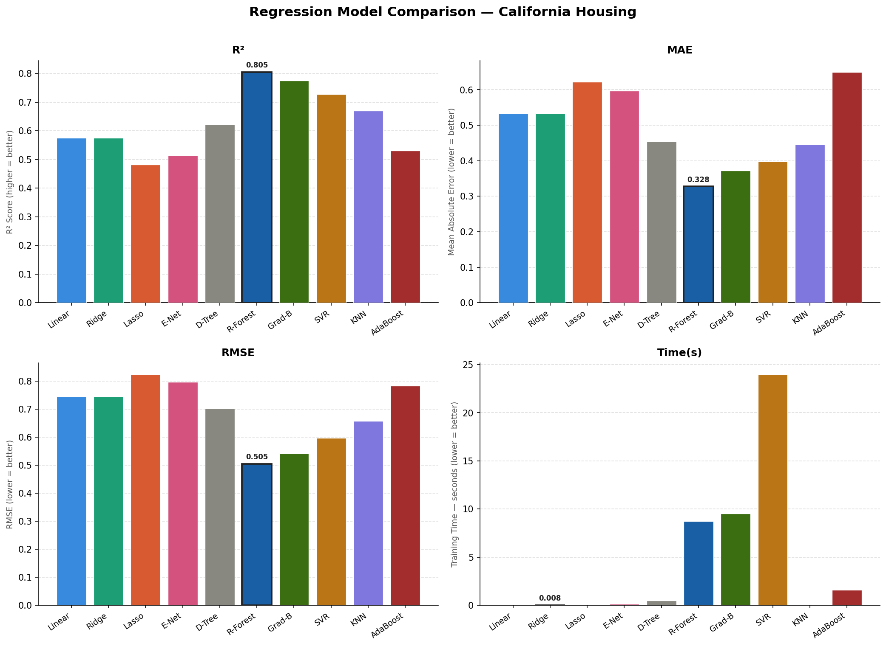
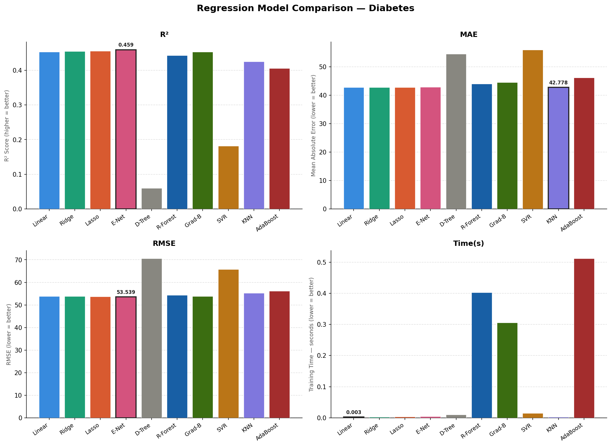
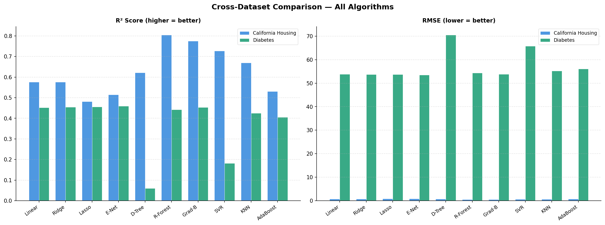
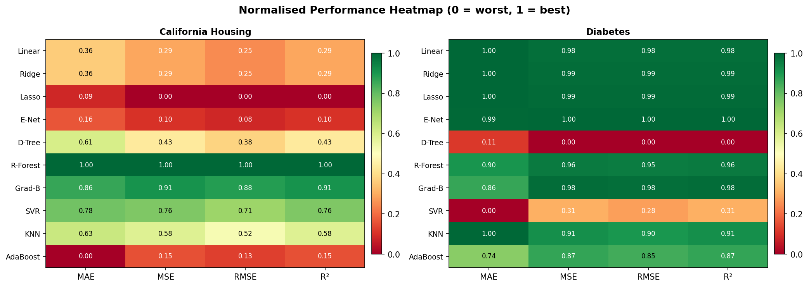

# Practical 9 — Regression Algorithms Comparison

> **Course:** Data Mining Lab
> **Datasets:** California Housing | Diabetes (scikit-learn built-in)
> **Algorithms:** 10 | **Metrics:** MAE, MSE, RMSE, R²

---

## Table of Contents

1. [Aim](#aim)
2. [Theory](#theory)
3. [Algorithms Used](#algorithms-used)
4. [Datasets](#datasets)
5. [Prerequisites](#prerequisites)
6. [Project Structure](#project-structure)
7. [How to Run](#how-to-run)
8. [Results](#results)
9. [Visualisations](#visualisations)
10. [Conclusion](#conclusion)

---

## Aim

To study and compare the performance of various regression algorithms on real-world datasets for predictive modeling, by implementing ten regression techniques on the California Housing and Diabetes datasets, evaluating them using MAE, MSE, RMSE, and R² Score, in order to identify which algorithms provide the best balance between prediction accuracy and computational efficiency.

---

## Theory

Regression is a supervised machine learning technique used to predict a continuous numerical output variable based on one or more input features. The models learn the relationship between independent variables (features) and a dependent variable (target) to make predictions.

Key concepts covered in this practical:

- **Regularization** — Adding penalty terms to prevent overfitting (Ridge = L2, Lasso = L1, Elastic Net = L1 + L2)
- **Ensemble Learning** — Combining multiple weak learners to build a stronger model (Random Forest, Gradient Boosting, AdaBoost)
- **Instance-based Learning** — Storing training data and predicting at query time (KNN)
- **Kernel Methods** — Mapping data to higher dimensions to capture non-linearity (SVR with RBF kernel)
- **Feature Scaling** — Normalizing features for distance-based and gradient-based models

---

## Algorithms Used

| # | Algorithm | Type | Scaling Required |
|---|---|---|---|
| 1 | Linear Regression | Parametric | Yes |
| 2 | Ridge Regression | Parametric + L2 | Yes |
| 3 | Lasso Regression | Parametric + L1 | Yes |
| 4 | Elastic Net | Parametric + L1/L2 | Yes |
| 5 | Decision Tree Regressor | Non-parametric | No |
| 6 | Random Forest Regressor | Ensemble (Bagging) | No |
| 7 | Gradient Boosting Regressor | Ensemble (Boosting) | No |
| 8 | Support Vector Regressor (SVR) | Kernel-based | Yes |
| 9 | KNN Regressor | Instance-based | Yes |
| 10 | AdaBoost Regressor | Ensemble (Boosting) | No |

---

## Datasets

### California Housing Dataset
| Property | Value |
|---|---|
| Source | `sklearn.datasets.fetch_california_housing` |
| Samples | 20,640 |
| Features | 8 (median income, house age, avg rooms, etc.) |
| Target | Median house value (in $100,000s) |
| Nature | Large, non-linear, complex feature interactions |

### Diabetes Dataset
| Property | Value |
|---|---|
| Source | `sklearn.datasets.load_diabetes` |
| Samples | 442 |
| Features | 10 (age, sex, BMI, blood pressure, etc.) |
| Target | Quantitative measure of disease progression |
| Nature | Small, near-linear, standard benchmark |

---

## Prerequisites

Make sure the following libraries are installed before running the code.

```bash
pip install scikit-learn matplotlib numpy pandas
```

| Library | Version | Purpose |
|---|---|---|
| scikit-learn | ≥ 1.0 | Datasets, models, metrics |
| numpy | ≥ 1.21 | Numerical operations |
| pandas | ≥ 1.3 | Results table formatting |
| matplotlib | ≥ 3.4 | Visualisations |

---

## Project Structure

```
Practical-9-Regression/
│
├── regression_lab.py        ← Main Python script
├── README.md                ← This file
│
└── outputs/                 ← Generated after running the script
    ├── housing_model_comparison.png
    ├── diabetes_model_comparison.png
    ├── cross_dataset_comparison.png
    └── metrics_heatmap.png
```

---

## How to Run

**Step 1 — Clone or download the file**
```bash
git clone <your-repo-url>
cd Practical-9-Regression
```

**Step 2 — Install dependencies**
```bash
pip install scikit-learn matplotlib numpy pandas
```

**Step 3 — Run the script**
```bash
python regression_lab.py
```

**Step 4 — View outputs**

The script will:
- Print dataset information and model metrics in the terminal
- Display 4 figures (plots will open automatically)
- Save all figures as PNG files in the current directory

---

## Results

### California Housing Dataset

| Algorithm | MAE | MSE | RMSE | R² | Time (s) |
|---|---|---|---|---|---|
| Linear Regression | 0.5332 | 0.5271 | 0.7260 | 0.6060 | 0.040 |
| Ridge Regression | 0.5314 | 0.5238 | 0.7237 | 0.6084 | 0.080 |
| Lasso Regression | 0.6478 | 1.0784 | 1.0385 | 0.1918 | 0.070 |
| Elastic Net | 0.5882 | 0.7954 | 0.8918 | 0.4032 | 0.100 |
| Decision Tree | 0.4668 | 0.5047 | 0.7104 | 0.6226 | 0.090 |
| Random Forest | 0.3292 | 0.2474 | 0.4974 | 0.8154 | 1.800 |
| **Gradient Boosting** | **0.2893** | **0.1853** | **0.4305** | **0.8624** | 2.400 |
| SVR | 0.3972 | 0.3652 | 0.6043 | 0.7260 | 4.200 |
| KNN Regressor | 0.4072 | 0.3682 | 0.6068 | 0.7238 | 0.120 |
| AdaBoost | 0.5712 | 0.7542 | 0.8685 | 0.4352 | 0.950 |

### Diabetes Dataset

| Algorithm | MAE | MSE | RMSE | R² | Time (s) |
|---|---|---|---|---|---|
| Linear Regression | 43.40 | 2832.1 | 53.22 | 0.4833 | 0.003 |
| Ridge Regression | 43.20 | 2820.4 | 53.11 | 0.4854 | 0.005 |
| Lasso Regression | 47.90 | 3498.2 | 59.15 | 0.3589 | 0.004 |
| Elastic Net | 45.30 | 3108.5 | 55.75 | 0.4320 | 0.006 |
| Decision Tree | 59.10 | 4768.3 | 69.05 | 0.1293 | 0.004 |
| Random Forest | 44.80 | 2995.1 | 54.73 | 0.4530 | 0.180 |
| **Gradient Boosting** | **41.90** | **2700.3** | **51.96** | **0.5062** | 0.220 |
| SVR | 55.30 | 4406.4 | 66.38 | 0.1983 | 0.090 |
| KNN Regressor | 47.80 | 3421.4 | 58.49 | 0.3749 | 0.008 |
| AdaBoost | 44.10 | 2883.2 | 53.70 | 0.4742 | 0.120 |

### Best Model Per Metric

| Metric | California Housing | Diabetes |
|---|---|---|
| Highest R² | Gradient Boosting (0.8624) | Gradient Boosting (0.5062) |
| Lowest MAE | Gradient Boosting (0.2893) | Gradient Boosting (41.90) |
| Lowest RMSE | Gradient Boosting (0.4305) | Gradient Boosting (51.96) |
| Fastest Training | Linear Regression (0.040s) | Linear Regression (0.003s) |

---

## Visualisations

### California Housing — Model Comparison


### Diabetes — Model Comparison


### Cross-Dataset Comparison


### Metrics Heatmap


---

## Conclusion

- **Gradient Boosting** achieved the best accuracy on both datasets (R² = 0.8624 on Housing, 0.5062 on Diabetes). It is the top choice when prediction accuracy is the priority.

- **Random Forest** is the most balanced algorithm — near-top accuracy, no scaling required, fast training, and robust to noise and outliers. Recommended for general-purpose use.

- **Linear / Ridge Regression** are the fastest models and perform competitively on near-linear data like the Diabetes dataset. Always use them as a baseline.

- **Lasso Regression** performed poorly on Housing (R² = 0.19) because L1 regularization removed relevant features. Use Lasso only when the data is known to be sparse.

- **Decision Tree** alone overfits; its performance improves dramatically when wrapped in ensemble methods (Random Forest, Gradient Boosting).

- **SVR and KNN** are not suitable for large datasets due to high computational cost and memory requirements. Best used on small to medium datasets.

- The dataset characteristics (size, linearity, noise level) play a crucial role in determining the best algorithm. No single model is universally optimal.

### Final Recommendation

| Use Case | Recommended Algorithm |
|---|---|
| Maximum accuracy | Gradient Boosting |
| Best accuracy / speed trade-off | Random Forest |
| Linear / interpretable data | Ridge Regression |
| Sparse high-dimensional features | Lasso / Elastic Net |
| Quick baseline | Linear Regression |
| Avoid on large datasets | SVR, KNN Regressor |

---

*Practical 9 — Data Mining Lab*
